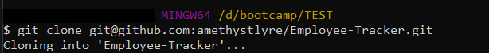
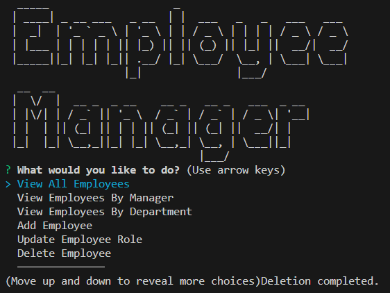

# Employee-Tracker


## Description
    
A content management system that can be used to manage a company's employee database by following commandline prompts.
    
## Table of Contents
    
- [Installation](#installation)
- [Usage](#usage)
- [Credits](#credits)
- [License](#license)
- [How to Contribute](#how-to-contribute)
- [Tests](#tests)
    
## Installation
    
1. Clone this Git repo to your local directory.<br>
<br>
2. If you haven't already installed MySQL Server, you may need to [download](https://dev.mysql.com/) the relevant version and install this on your local machine first.
3. Open the repo folder in VS Studio or your preferred code editor.<br>
4. Open the Integrated Terminal and enter command `npm install` to download the required Inquirer package.<br>

5. Run ```mysql -u root -p``` command to connect to your local database and run ```source db/schema.sql``` to setup the schema for the database.
6. (Optional) Add sample data to your DB by running ```source db/seeds.sql```.
7. Navigate to the lib/connectDB.js file and update the username and password strings for connecting to your own local server.

## Usage
    
Once the dependencies and database schema have been installed and setup, you can invoke the application with command `node index.js` in the terminal. Choose an action from the main menu and then follow any prompts to make changes to the database. For more detailed instructions, please watch the [walkthrough video](https://drive.google.com/file/d/1gMW8KVPM3I_1IaxkgsUjfrxmKpLxSlaM/view?usp=drive_link).<br>




    
## Credits
ASCII banners are created using third party package [figlet](https://www.npmjs.com/package/figlet).<br>
Table formatting are rendered using third party package [table](https://www.npmjs.com/package/table).

## License
<br>
This project is licensed under the MIT License - see the [LICENSE.md](license) file for details    
 
## How to Contribute
    
Feel free to contribute your ideas or bug fixes for this project by raising a new issue or new pull request.
    
## Tests
    
NA
